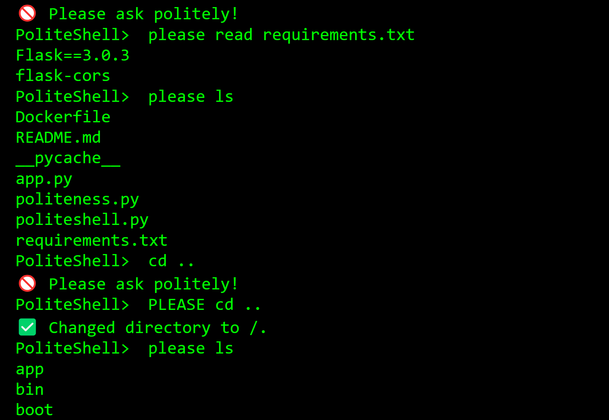

# Polite Shell

This is a linux style command line shell where it only works when you say please.

It only works if you say "please" or if you're nice in general.

Run politeshell.py for local usage, and you can use Linux commands to modify your computer system.

There is also a public server hosting a linux subsystem that is refreshed every so often:

https://politeshell.onrender.com/

I made this this for an assignment in an elective in college.

---

## Features

- Detects polite phrases automatically
- Accepts commands like `please ls`, `could you mkdir folder` and many more.
- Gives feedback based on your politeness level

---

## How to Run 

```bash
cd PoliteShell
python politeshell.py

```

or use the deployed server:

https://politeshell.onrender.com/

---

## Requirements

- Must have Linux, Windows Subsystem for Linux, etc.

---

*Created by William Rongerude*
