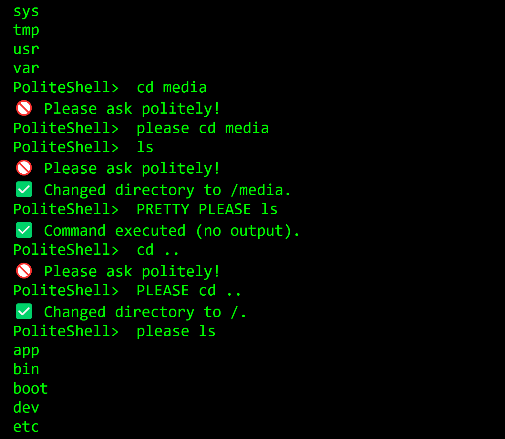

# 😃 PoliteShell 😃

A Linux/Bash style command line shell where you must say please.

Rude requests are rejected while courteous ones get system command execution.

Run politeshell.py for local usage, where real Linux commands modify your own system.

Or connect to the public server to see what others are changing:

https://politeshell.onrender.com/

---

## 😐 Features 😐

- Detects polite phrases automatically
- Accepts commands like `please ls`, `could you mkdir folder` and more to be added
- Gives feedback based on your politeness level

---

## 🛠 How to Run 🛠

```bash
cd PoliteShell
python politeshell.py

```

or

https://politeshell.onrender.com/

---

*Created by William Rongerude*
